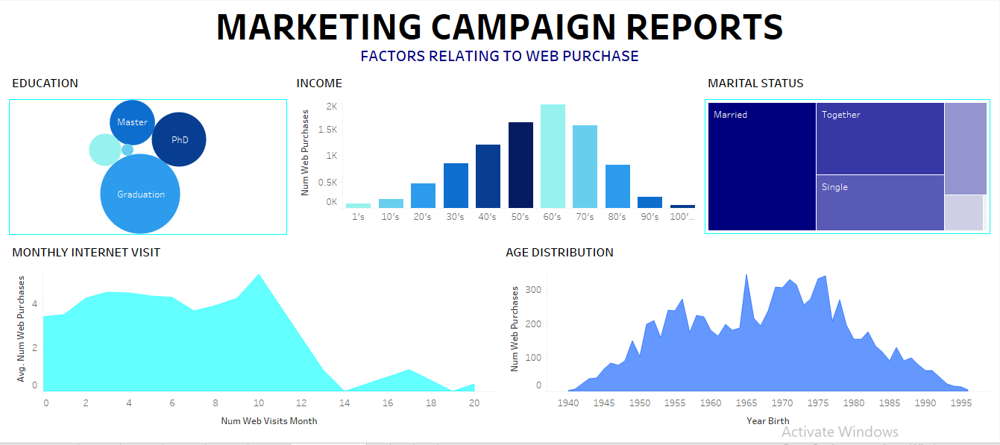
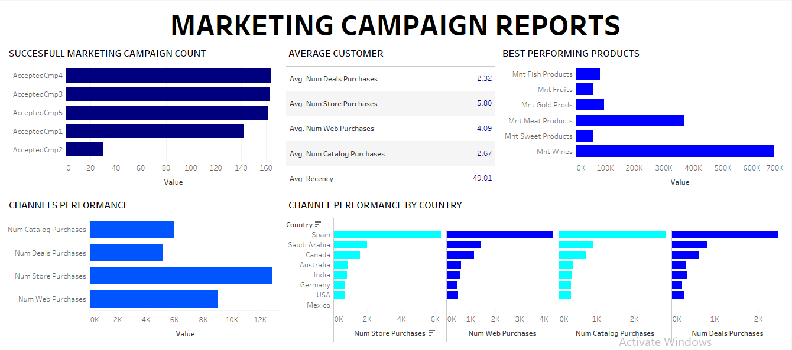

# Marketing-Analytics-Report

## Marketing Campaign Results

## INTRODUCTION

I obtained this Marketing campaign data of 2,240 customers of Maven Marketing, including customer profiles, product preferences, campaign successes/failures, and channel performance.

## PROBLEM STATEMENT
The recommended analysis to be carried on the data by the data analyst are as follows;
1.	Are there any null values or outliers? How will you handle them?
2.	What factors are significantly related to the number of web purchases?
3.	Which marketing campaign was the most successful?
4.	What does the average customer look like?
5.	Which products are performing best?
6.	Which channels are underperforming?

## DATA SOURCING
The data contain 2,240 rows and 28 columns. I didn’t need all the columns to complete my task or analysis but key is to understand the business problems and relevant data to used.

## DATA TRANSFORMATION/CLEANING
Data was efficiently cleaned and transformed using Excel, some of the applied steps are
-	First I apply filter using **crtl+shift+L** to the data.
-	Selecting blanks under the **Income** column and removing them, which reduces the number of rows by 24 making the total rows to be 2,216
-	I used box plot to identify if there are any outliers, which I notice two from customers in spain and Saudi arabia who had incomes of 153,924 and 666,666 respectively, but I included them in the analysis
## DATA MODELLING 
None available in this case Except a data dictionary to clearly explain the abbreviated column headers
## DATA ANALYSIS AND VISUALIZATION

The image above indicates the following, that;
1.	Factors that affect web purchase include
-	Education: graduate and people with higher education purchase more than others
-	People who visit the internet more often but less than 11 times are likely to make purchase.
-	More purchase also with increase in come level but a start in decrease when income level reaches 70’sK
-	 The web purchase is mostly done by Married people or people who are together
-	And their age or birth is within 65’s and 80’s who have most of the purchase

2.	Campaign 4 has the most successful customer conversion
3.	An average customer can be categorizing with respect to type of buy and other internet activities, which include average purchase of (I) 6 times in store (II) 4 web purchase (III) 3 of catalog (IV) 2 when there is %deal of price and (V) visit the internet not less than 49 times
4.	The best performing product is wine
5.	The best performing channel of purchase is the store purchase.
6.	Spain is the best country in purchasing through all the channels
## CONCLUSION AND RECOMMENDATION
-	The decline in number of web purchase per month after ten visit should be check and possibly rewarded with points accumulation that a customer can used to make purchase with the more he patronize the service.
-	There should be product expansion to attract younger users of the 90’s and above who frequently visit the internet than the older generations 
